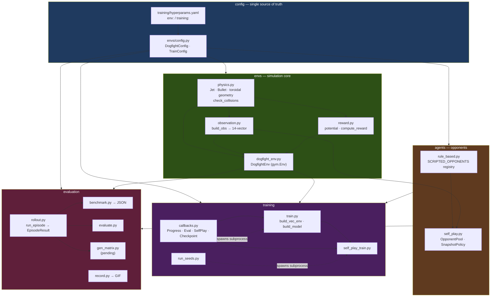
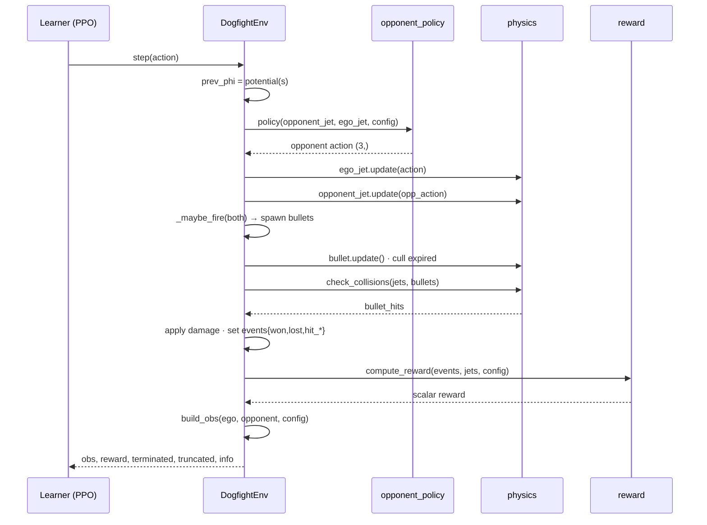
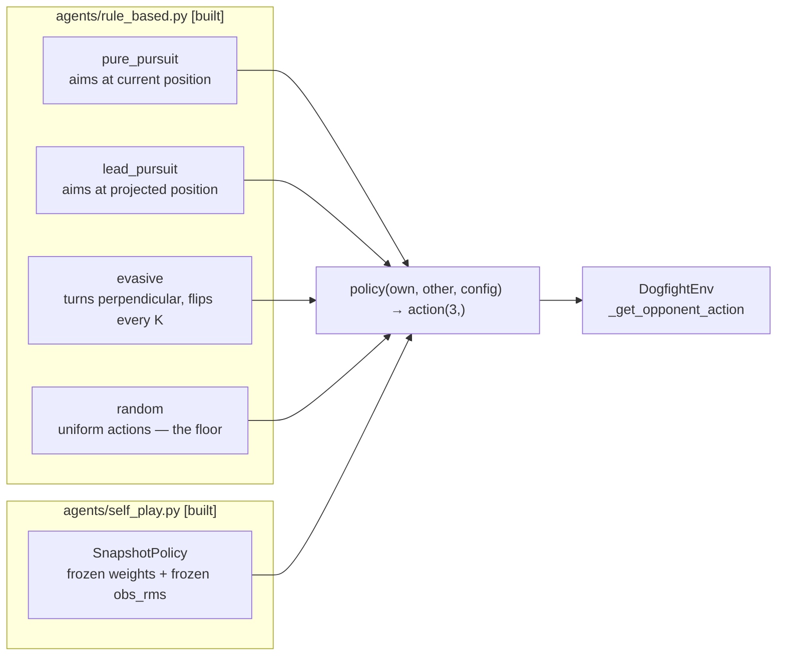
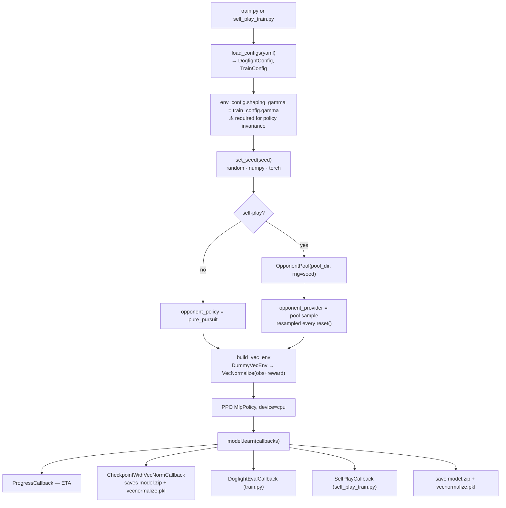
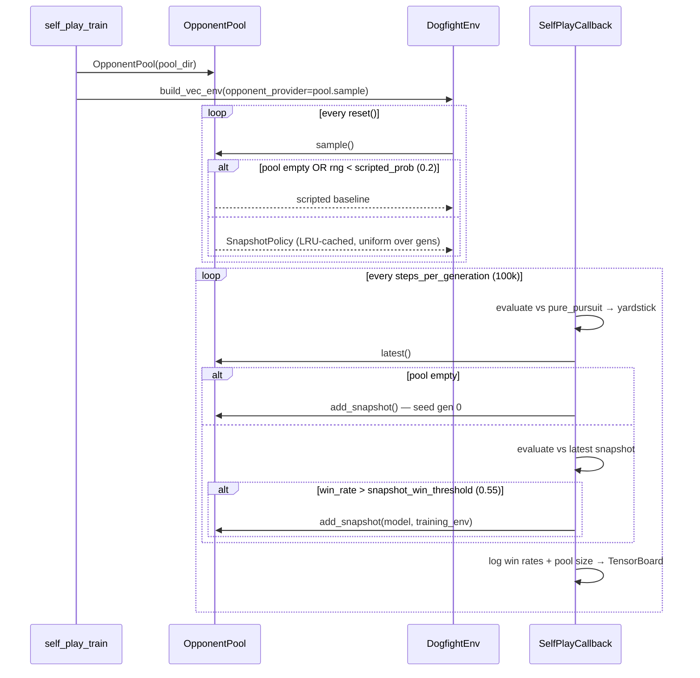
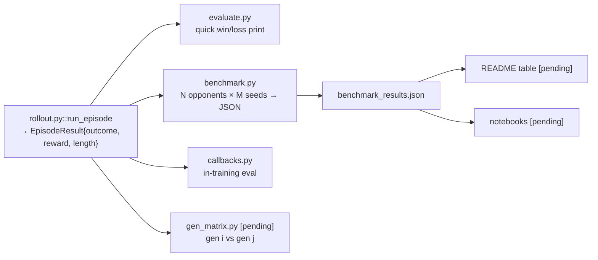

# Architecture

How this project is put together: the layers, the data that moves between them, and the
invariants that hold it all up. `IMPLEMENTATION_PLAN.md` describes *what to build and in
what order*; this document describes *what the built thing is*.

Status markers: **[built]** exists and is tested; **[pending]** designed here but not yet
written. Everything through Phase 4's tooling is built; Phase 5 and the two acceptance
experiments are pending.

---

## 1. What the system is

A 2D dogfight arena where a PPO agent learns air combat against a curriculum of
opponents — scripted bots first, then frozen snapshots of its own past selves.

Four properties drive nearly every design decision below:

- **The arena is a torus.** No walls. Every distance and bearing must be computed as a
  shortest path that may wrap around an edge. A single naive `bx - ax` anywhere is a bug.
- **The environment is symmetric.** Both jets have identical dynamics, and the
  observation builder takes `(own, other)` in that order. This is what makes self-play
  possible at all: an opponent is just the same network reading the mirrored observation.
- **Observations are normalized by running statistics.** This is the source of the
  subtlest failure mode in the codebase (§6.1) — the stats are state that must be
  versioned alongside every model.
- **Config is a single source of truth.** Physics constants exist in exactly one place;
  no module may invent a fallback default.

---

## 2. Layer map

Dependencies point strictly downward. Nothing in `envs/` imports from `training/`,
`agents/`, or `evaluation/` — the simulation knows nothing about who is learning from it.



### Module ownership

Each concern has exactly one owner. When adding code, find the owner rather than
introducing a second implementation.

| Concern | Owner | Notes |
|---|---|---|
| Toroidal geometry | `envs/physics.py` | `wrap_angle`, `wrapped_delta`, `toroidal_delta`, `relative_bearing` |
| Collision detection | `envs/physics.py` | `check_collisions` is the only implementation |
| Kinematics | `envs/physics.py` | `Jet.update`, `Bullet.update` |
| Observation encoding | `envs/observation.py` | `build_obs` — the sole definition of the 14-vector |
| Reward + shaping | `envs/reward.py` | `potential`, `compute_reward` |
| Episode orchestration | `envs/dogfight_env.py` | spawns, stepping, termination, rendering |
| Physics/training constants | `envs/config.py` | no other module may define a default |
| Scripted opponents | `agents/rule_based.py` | registered in `SCRIPTED_OPPONENTS` |
| Snapshot opponents | `agents/self_play.py` | `OpponentPool`, `SnapshotPolicy` |
| Rollout loop | `evaluation/rollout.py` | `run_episode` — every caller uses this one |

---

## 3. The simulation core

### 3.1 Step sequence

Ordering matters and is not arbitrary. The potential `φ(s)` is captured **before** any
movement, so that the shaping term compares the same transition the agent acted on.



Note the opponent acts on the state from **before** the ego jet moves — both jets decide
simultaneously from the same world state, which is what makes the matchup fair.

### 3.2 Spaces

**Action** — `Box(3,)`, all clipped inside `Jet.update`:

| Index | Name | Range | Effect |
|---|---|---|---|
| 0 | turn | `[-1, 1]` | `θ += turn * max_turn_rate` |
| 1 | throttle | `[0, 1]` | `v = min_speed + throttle * (max_speed - min_speed)` |
| 2 | fire | `[0, 1]` | fires when `> 0.5` and gun is off cooldown |

**Observation** — `Box(14,)`, roughly `[-1, 1]`, built by `build_obs(own, other, config)`:

| Index | Content | Encoding |
|---|---|---|
| 0–1 | own position | arena-normalized to `[-1, 1]` |
| 2–3 | own heading | `sin θ`, `cos θ` |
| 4 | own speed | `v / max_speed` |
| 5–6 | relative position | **toroidal** delta, arena-normalized |
| 7 | distance | `‖d‖ / arena_diag` |
| 8–9 | relative bearing | `sin`, `cos` of bearing to opponent |
| 10–11 | opponent heading | `sin θ`, `cos θ` |
| 12 | gun cooldown | `cooldown / max_cooldown` |
| 13 | own health | `health / max_health` |

Headings are encoded as `(sin, cos)` pairs rather than raw angles so the network never
sees the discontinuity at `±π` — two nearly identical headings must never look far apart.

**The symmetry that enables self-play:** `build_obs` reads only `own` and `other`. Call it
`build_obs(ego, opponent, cfg)` for the learner and `build_obs(opponent, ego, cfg)` for
the opponent, and the same network weights work from either seat.

### 3.3 Reward

```
r = kill_reward        if won              (+100)
  + death_penalty      if lost             (-100)
  + hit_reward         if hit_opponent     (+7)
  + hit_taken_penalty  if got_hit          (-0.8)
  + fire_cone_reward   if |bearing| ≤ 15°  (+0.2)
  + time_penalty                           (-0.04)
  + γ·φ(s') − φ(s)                         ← potential-based shaping
```

where `φ(s) = −closing_shaping_scale · distance / arena_diag`, and `φ(terminal) ≡ 0`.

The shaping term follows Ng et al. (1999): a reward of the form `γ·φ(s') − φ(s)` is
**policy-invariant** — it can speed up learning but provably cannot change which policy
is optimal. That guarantee rests on two conditions, both of which are load-bearing and
both of which are easy to break silently:

1. **`shaping_gamma` must equal the learner's `gamma`.** Both `train.py` and
   `self_play_train.py` assign `env_config.shaping_gamma = train_config.gamma` immediately
   after loading config. A new training entrypoint that forgets this line breaks the
   guarantee with no error.
2. **`φ` at a terminal state must be 0.** Otherwise the agent can farm shaping reward by
   dying, or be taxed for winning.

`tests/test_reward.py` holds a **telescoping canary**: with `γ = 1`, the shaping
contributions around any closed loop in state space must sum to exactly 0. Treat that
test as untouchable — if a reward change breaks it, the change is wrong, not the test.

---

## 4. Opponents

Every opponent — scripted or learned — satisfies one interface:

```python
policy(own_jet, other_jet, config) -> np.ndarray(3,)
```

That uniformity is why `DogfightEnv` never branches on opponent type, and why a snapshot
of the agent can be dropped into the same slot as a rule-based bot.



The four scripted bots are a difficulty ladder, deliberately: `random` is the floor,
`pure_pursuit` at fixed throttle is exploitable, `lead_pursuit` is strictly harder to
dodge, and `evasive` tests something different in kind — whether the agent can *chase and
finish* rather than merely survive a head-on merge.

**Statefulness without global state.** `evasive` and `random` need randomness, but a
module-level RNG would couple parallel envs and destroy reproducibility. Instead
`_jet_rng(jet)` lazily attaches an RNG to the `Jet` object, seeded from its spawn pose.
Jets are recreated every `reset()`, so this is per-episode, independent across parallel
envs, and reproducible under a fixed env seed — because the spawn pose itself comes from
the env's seeded RNG.

---

## 5. Training

Two entrypoints share one env/model builder. The only structural difference is whether
the env gets a fixed `opponent_policy` or a per-episode `opponent_provider`.



### 5.1 The self-play loop

The plan sketched an explicit outer generation loop. The implementation instead uses a
single `model.learn()` driven by `SelfPlayCallback`, which is equivalent but simpler: the
opponent is resampled per *episode* regardless, and the callback already has
`self.model` and `self.training_env` — exactly what a snapshot needs.



**Warm start is emergent, not a phase.** `OpponentPool.sample()` returns a scripted
policy whenever the pool is empty, so training automatically begins against pure pursuit
and shifts toward snapshots as they appear. No separate warm-start stage is needed — the
plan's step 1 falls out of the sampling rule for free.

**The gate prevents a degenerate pool.** Snapshots are only added when the learner beats
the current latest by >55%. Without that gate the pool fills with sideways-drifting
policies and "self-play" becomes noise injection.

### 5.2 Pool layout on disk

The pool is fully reconstructable from its directory alone, which is what makes training
resumable:

```
models/pool/
  gen_0/  model.zip   obs_rms.pkl   ← frozen deepcopy of VecNormalize obs stats
  gen_1/  model.zip   obs_rms.pkl
  ...
```

`_discover_generations()` parses the integer from each `gen_{k}` and sorts numerically —
so `gen_10` sorts after `gen_9`, which lexicographic sorting would get wrong. Beyond
`pool_max_size` (20), the oldest generation is evicted from disk. Loaded snapshots are
LRU-cached (5 at a time) so per-episode sampling stays cheap.

---

## 6. Invariants

These are the things that break silently — no exception, no failing test, just quietly
worse results. Each is stated as a rule, a reason, and its enforcement.

### 6.1 A model and its VecNormalize stats are one artifact

`VecNormalize` normalizes observations by a **running mean/variance that keeps changing
during training**. A policy is only meaningful against the statistics it was trained
under. Therefore `model.zip` and `vecnormalize.pkl` are a **pair**: never ship, load, or
evaluate one without its match. Every save site writes both together.

The sharpest version of this is the **frozen-stats trap in self-play**. A snapshot
opponent must normalize with a deep copy of `obs_rms` taken *at snapshot time* — not the
live training stats, which continue to drift. Share the live stats and old snapshots
start seeing observations on a scale they never trained on, degrading into free wins that
look exactly like the agent getting stronger. This is enforced by `copy.deepcopy(obs_rms)`
in `add_snapshot`, and by a test in `tests/test_self_play.py` that snapshots a model,
mutates the live stats to nonsense, and asserts the snapshot still normalizes with the
captured values.

The normalization formula is duplicated in `SnapshotPolicy._normalize` and
`record.py::_normalize_obs` because neither can reach SB3's internal method — both must
stay identical to `VecNormalize._normalize_obs`:

```python
np.clip((obs - obs_rms.mean) / np.sqrt(obs_rms.var + 1e-8), -10.0, 10.0)
```

### 6.2 Evaluation never updates statistics

Any eval env must be loaded with `training=False` and `norm_reward=False`. Otherwise
evaluation rollouts mutate the running stats and the measurement corrupts the thing being
measured. `build_frozen_eval_env` handles this by round-tripping the training env's stats
through a temp pickle.

Reward normalization is disabled at eval time for a second reason: reported rewards must
be in real environment units, or they are not comparable across runs.

### 6.3 Config has no fallbacks

No `config.get(...)` with a default, no `setdefault`, no hardcoded physics literal outside
`config.py`. A fallback default is a second source of truth that silently disagrees with
the first. `_filter_known` warns loudly on unknown YAML keys rather than ignoring typos —
a misspelled key must not silently keep the default.

### 6.4 Randomized spawns are required for meaningful evaluation

Fixed spawns plus a deterministic policy make all *n* evaluation episodes the **same
trajectory**, reported as if it were a sample of size *n*. `randomize_spawns` (default on)
fixes this, and is also what prevents self-play from degenerating into opening-move
memorization. It is turned off only for demo recording, where a fixed scenario is wanted.

Spawns rejection-sample uniform positions until toroidal separation ≥ 300px, drawing from
`self.np_random` so a fixed seed reproduces the layout exactly.

---

## 7. Evaluation

One rollout implementation, several consumers:



Outcome classification reads the terminal `info["events"]`: `won` → win, `lost` → loss,
otherwise timeout. Timeouts are tracked separately from losses on purpose — an agent that
stalls to avoid dying and one that loses fights are different failure modes, and a bare
"win rate" hides that distinction.

`benchmark.py` records the git commit and timestamp into its JSON metadata, so a results
table can always be traced back to the code that produced it.

`record.py` cannot use the vec-wrapped env, because `render()` isn't reachable through the
wrapper. It uses a raw `DogfightEnv(render_mode="rgb_array")` and applies the frozen
normalization by hand (§6.1) — the reason that formula appears twice in the codebase.

### 7.1 The generation matrix **[pending]**

The centerpiece evidence for Phase 3, and the last significant piece of missing tooling.
It plays every pool generation against every other and reports a win-rate matrix:

```
        gen_0  gen_1  gen_2  gen_3  gen_4
gen_0     -     0.38   0.31   0.22   0.19
gen_1   0.62     -     0.41   0.35   0.28
...
```

Acceptance requires gen *N* beating gen *N−3* more than 60% of the time. A matrix that is
uniformly ~0.5 means self-play produced no progress — which is a real possible outcome
and must be reported honestly if it happens.

---

## 8. Current state


Green = accepted · amber = code complete, acceptance pending · red = not started.

| Phase | Code | Evidence |
|---|---|---|
| 0 — hygiene | done | accepted |
| 1 — config SSOT | done | accepted |
| 2 — geometry + reward | done | accepted — baseline comparison showed no regression |
| 3 — self-play | done, 58 tests pass | **missing** — generation matrix not written |
| 4 — benchmark + recording | done | **missing** — only smoke-model numbers so far |
| 5 — README, notebooks, CI | not started | — |

**The honest summary: we have a complete pipeline and no results from it yet.** The 1M-step
self-play run finished and produced `models/ppo_selfplay.zip` with a 5-generation pool, but
nothing has yet measured whether those generations actually improve on each other. The
benchmark table renders correctly and the GIF recorder works, but every number produced so
far came from a throwaway smoke checkpoint. Closing Phases 3 and 4 is a matter of writing
`gen_matrix.py` and pointing the existing tools at the real checkpoint — not of writing
more pipeline.

### Known gaps

- `evaluation/gen_matrix.py` does not exist.
- `assets/demo.gif` has not been recorded from a real model.
- `ruff` is declared in `pyproject.toml` dev extras but is not installed in `.venv`.
- No CI yet; the suite must run headless with `SDL_VIDEODRIVER=dummy`.
- A 100k-step budget reliably loses to pure pursuit (~61-step episodes, a suicide-charge
  signature). This is a known property of the budget, **not** a regression — don't chase it.

---

## 9. Conventions

- **Interpreter**: always `./.venv/Scripts/python.exe`. Never bare `python` or `py`.
- **Namespace packages**: no `__init__.py` anywhere. `pip install -e .` makes
  `python -m pkg.module` work from the repo root.
- **Determinism**: `set_seed` covers `random`, `numpy`, and `torch`; env randomness flows
  through `self.np_random`; scripted-bot randomness flows through per-jet RNGs seeded from
  spawn poses. A fixed seed reproduces a run end to end.
- **Device**: `cpu` throughout. These networks are small; GPU transfer overhead dominates.
- **Testing**: `pytest` at the repo root, headless via `SDL_VIDEODRIVER=dummy`.
