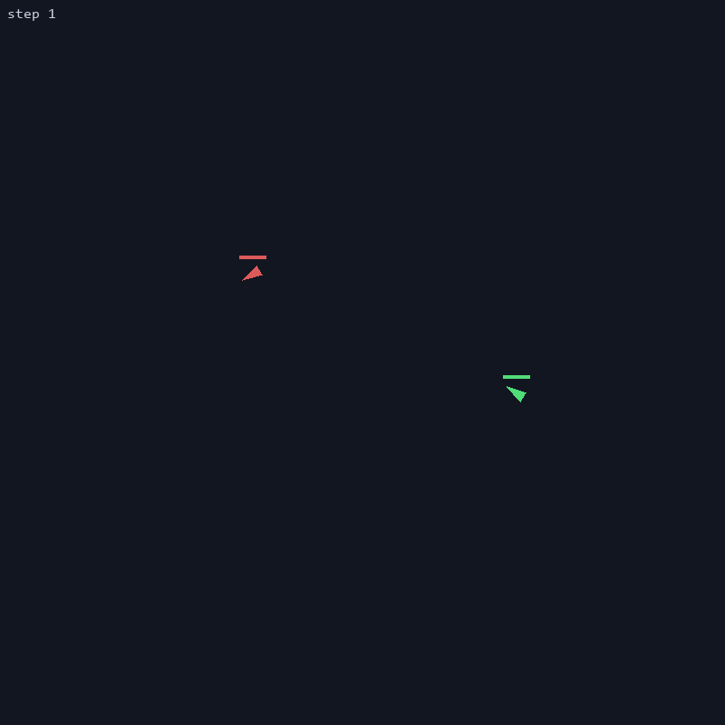

# Dogfight RL

<p align="center">
  
</p>

<p align="center">
  <em>The self-play agent (green) versus the scripted <code>pure_pursuit</code> bot (red); yellow dots are bullets.<br>
  The arena is a torus &mdash; a jet crossing an edge reappears on the opposite side. That is the environment, not a rendering glitch.</em>
</p>

Two jets fight in a wrap-around 800&times;800 arena. Each controls turn rate, throttle, and
trigger; bullets travel twice as fast as a jet, so hitting anything requires leading the
target. The ego jet is a PPO policy (Stable-Baselines3) trained through a self-play
curriculum: it starts against scripted bots and, as it improves, frozen snapshots of its
past selves join an opponent pool that it is resampled against every episode. The result
is an agent that reliably hunts down evasive and erratic opponents, and that survives
&mdash; but does **not** finish &mdash; against bots that constantly turn to face it. That
gap is real, and it is documented below rather than smoothed over.

---

## Results

Final self-play policy against every scripted opponent.

| Opponent | Win rate | Loss rate | Timeout rate | Mean return | Mean episode length |
|---|---|---|---|---|---|
| `pure_pursuit` | **14.4% ± 5.7** | 1.1% | 84.4% | 38.0 ± 12.9 | 1743 |
| `lead_pursuit` | **24.4% ± 8.7** | 1.1% | 74.4% | 55.7 ± 10.0 | 1599 |
| `evasive` | **77.8% ± 5.7** | 0.0% | 22.2% | 219.1 ± 12.1 | 1345 |
| `random` | **76.7% ± 8.2** | 0.0% | 23.3% | 209.5 ± 18.5 | 1004 |

`models/ppo_selfplay.zip` + `models/vecnormalize_selfplay.pkl` &middot; 30 episodes &times; 3 seeds [0, 1, 2] =
90 episodes per opponent &middot; config `training/hyperparams.yaml` &middot; commit `24c9c40`
&middot; 2026-07-21. Win rate is mean &plusmn; std **across seeds**; deterministic policy,
randomized spawns.

```bash
python -m evaluation.benchmark \
  --model models/ppo_selfplay.zip --vecnorm models/vecnormalize_selfplay.pkl \
  --episodes 30 --seeds 0 1 2 --out benchmark_results.json
```

### Reading this table honestly

The agent beats `evasive` and `random` roughly eight times in ten and **loses essentially
never** (1.1% or less against every opponent). What it does against
`pure_pursuit` and `lead_pursuit` is time out: it holds position, refuses bad merges, and
runs the clock to the 2000-step limit. Self-play rewarded *not losing* against copies of
itself, and closing on a bot that permanently points its nose at you is exactly the risky
commitment such a policy learns to avoid. This is a property of the objective, not a bug
&mdash; see [Design notes](#design-notes).

### Self-play curriculum

Generation *i* (rows, flying as ego) versus generation *j* (columns, as opponent), win rate
over 20 seeded episodes per cell. The diagonal is a policy against itself and is omitted.

| ego \ opponent | gen 0 | gen 1 | gen 2 | gen 3 | gen 4 |
|---|---|---|---|---|---|
| **gen 0** | — | 0% | 0% | 0% | 0% |
| **gen 1** | 100% | — | 0% | 0% | 0% |
| **gen 2** | 100% | 100% | — | 0% | 5% |
| **gen 3** | 100% | 100% | 45% | — | 20% |
| **gen 4** | 100% | 100% | 90% | 40% | — |

Progress is unambiguous across *distance*: every generation shuts out everything three or
more steps behind it at 100%, gen 1 over gen 0 included. Between *adjacent*
generations it is much tighter, and late in training the newest snapshot does not cleanly
beat the one before it &mdash; gen 3 takes 45% against gen 2, gen 4 takes
40% against gen 3. The curriculum is flattening out, which is what
diminishing returns look like in a matrix.

A row and its mirrored column do not sum to 100%: a timeout counts as a non-win for both
sides. Gen 2 versus gen 4 (5% / 90%) is a decisive pairing; gen 3 versus
gen 4 (20% / 40%) mostly ends on the clock instead &mdash; the same
stalling reflex that shows up against the pursuit bots above.

The acceptance criterion, generation *N* beating generation *N*&minus;3 at least
60% of the time, **passes**: gen 3 vs gen 0 = 100%, gen 4 vs gen 1 = 100%.

```bash
python -m evaluation.gen_matrix --pool-dir models/pool \
  --episodes 20 --out gen_matrix.json
```

So self-play worked as a curriculum *and* did not translate into finishing power against
scripted pursuit. Both statements are true at once; usually only the first gets reported.

---

## Quickstart

Requires Python &ge; 3.11.

```bash
git clone <repo-url> && cd dog_fight
python -m venv .venv && .venv/Scripts/activate   # Linux/macOS: source .venv/bin/activate
pip install -e ".[dev]"
pytest                                           # 61 tests, ~20s
```

Train a baseline agent against the scripted pursuit bot:

```bash
python -m training.train --config training/hyperparams.yaml
```

Train with the self-play curriculum (this is what produced the results above):

```bash
python -m training.self_play_train --config training/hyperparams.yaml
```

Both default to 1,000,000 steps. Pass `--timesteps 2048` for a smoke run, and watch
progress with `tensorboard --logdir runs/`. Training is CPU-only by design &mdash; these
networks are small enough that GPU transfer overhead dominates.

Evaluate, watch, and record:

```bash
python -m evaluation.benchmark --model models/ppo_selfplay.zip --vecnorm models/vecnormalize_selfplay.pkl
python -m evaluation.visualize --model models/ppo_selfplay.zip --vecnorm models/vecnormalize_selfplay.pkl --opponent evasive
python -m evaluation.record    --model models/ppo_selfplay.zip --vecnorm models/vecnormalize_selfplay.pkl --out assets/demo.gif
```

Multi-seed runs: `python -m training.run_seeds --seeds 0 1 2 3 4` (add `--self-play`).

> **Trained weights are not in this repository.** `models/` and `runs/` are gitignored; no
> binary checkpoints ship here. `assets/demo.gif` and the two JSON result files are the
> committed evidence. To get a policy of your own, run the training commands above &mdash;
> and give them the full budget. At 100k steps the agent reliably *loses* to pure pursuit
> with ~61-step episodes (a suicide-charge signature); roughly 1M steps is where it stops
> throwing itself at the enemy.

On a headless machine (CI, containers, WSL without a display) set `SDL_VIDEODRIVER=dummy`
&mdash; pygame is imported by the env even when nothing is being rendered.

---

## Environment

### Action space &mdash; `Box(3,)`, continuous

| Index | Action | Range | Effect |
|---|---|---|---|
| 0 | turn | `[-1, 1]` | &minus;1 = full left, +1 = full right, scaled by `max_turn_rate` |
| 1 | throttle | `[0, 1]` | interpolates speed between `min_speed` and `max_speed` |
| 2 | fire | `[0, 1]` | fires when > 0.5 and the gun is off cooldown |

Continuous on purpose: discretizing the turn rate, as DQN would require, produces visibly
jerky and unrealistic flight.

### Observation space &mdash; `Box(14,)`, all normalized

Built by `build_obs(ego, opponent, config)` in [envs/observation.py](envs/observation.py).
The function is **symmetric in its two jet arguments**, so the same call produces the
opponent's own view &mdash; which is what lets a frozen snapshot fly the red jet.

| Index | Feature | Formula |
|---|---|---|
| 0 | ego x | `x / W * 2 - 1` |
| 1 | ego y | `y / H * 2 - 1` |
| 2&ndash;3 | ego heading | `sin(theta)`, `cos(theta)` |
| 4 | ego speed | `v / max_speed` |
| 5&ndash;6 | relative offset | toroidal `dx / W`, `dy / H` |
| 7 | distance | `dist / arena_diag` |
| 8&ndash;9 | bearing to opponent | `sin(b)`, `cos(b)` where `b = atan2(dy, dx) - theta` |
| 10&ndash;11 | opponent heading | `sin(theta_opp)`, `cos(theta_opp)` |
| 12 | gun cooldown | `cooldown / max_cooldown` |
| 13 | health | `health / max_health` |

Angles are encoded as sin/cos pairs so the policy never meets the 359&deg;&rarr;0&deg;
discontinuity, and every relative quantity uses the *toroidal* shortest path &mdash;
chasing an opponent across the wrap seam is often the shorter route, and the observation
says so.

### Reward

| Term | Value | When |
|---|---|---|
| `kill_reward` | `+100.0` | opponent destroyed |
| `death_penalty` | `-100.0` | ego destroyed |
| `hit_reward` | `+7.0` | per bullet landed (four hits kill) |
| `hit_taken_penalty` | `-0.8` | per bullet absorbed |
| `fire_cone_reward` | `+0.2` | per step with the opponent inside the &plusmn;15&deg; nose cone |
| shaping | `gamma * phi(s') - phi(s)` | every step, with `phi(s) = -0.5 * dist / arena_diag` |
| `time_penalty` | `-0.04` | every step |

The distance term is **potential-based** (Ng et al., 1999): written as
`gamma * phi(s') - phi(s)` it cannot change the optimal policy, only how quickly it is
found. Two conditions make that guarantee hold, and both are enforced and tested here.
`shaping_gamma` is synced to PPO's `gamma` at every training entry point, and
`phi(terminal)` is forced to `0` on a win or loss &mdash; otherwise the agent could farm
shaping reward by dying close to the enemy. The `time_penalty` exists because without it,
indefinite survival is itself a winning strategy. Note the deliberate asymmetry between
`hit_reward` and `hit_taken_penalty`: absorbing a bullet costs far less than landing one
earns, which biases the policy toward aggression.

### Physics

| Constant | Value | Constant | Value |
|---|---|---|---|
| arena | 800 &times; 800, toroidal | speed | 2.0 &ndash; 6.0 px/step |
| max turn rate | 4&deg;/step | jet radius | 10.0 px |
| max health | 100 | hit damage | 25 (four hits) |
| bullet speed | 12.0 px/step | bullet lifetime | 60 steps |
| bullet radius | 3.0 px | gun cooldown | 20 steps |
| episode limit | 2000 steps | spawns | randomized, &ge; 300 px apart |

Bullets fly at twice the jet top speed: fast enough to demand aim lead, slow enough that
dodging stays possible. The torus exists to kill corner-camping &mdash; there is no corner
to camp. Every one of these constants lives in [envs/config.py](envs/config.py) and is
overridden from [training/hyperparams.yaml](training/hyperparams.yaml); none is hardcoded
anywhere else.

---

## Project layout

```
envs/
  config.py           DogfightConfig + TrainConfig, the single source of truth
  physics.py          toroidal geometry, Jet, Bullet, the only collision code
  observation.py      14-dim symmetric observation
  reward.py           potential() + compute_reward()
  dogfight_env.py     the Gymnasium env and pygame rendering
agents/
  rule_based.py       pure_pursuit, lead_pursuit, evasive, random
  self_play.py        SnapshotPolicy (frozen obs stats) + OpponentPool
training/
  train.py            PPO against a fixed scripted opponent
  self_play_train.py  PPO against the resampled opponent pool
  callbacks.py        checkpoint, eval, and self-play snapshot callbacks
  run_seeds.py        the same config across N seeds, sequentially
  hyperparams.yaml    env: and training: sections
evaluation/
  rollout.py          run_episode(), the one rollout loop everything shares
  evaluate.py         single-opponent evaluation
  benchmark.py        all opponents x seeds -> benchmark_results.json
  gen_matrix.py       generation x generation win rates -> gen_matrix.json
  record.py           episode -> assets/demo.gif
  visualize.py        live pygame window
tests/                61 tests
project_docs/         ARCHITECTURE.md, implementation plan, roadmap
```

Full design rationale: [project_docs/ARCHITECTURE.md](project_docs/ARCHITECTURE.md).

---

## Design notes

**A checkpoint is a pair, always.** A `model.zip` is useless without the
`vecnormalize.pkl` saved at the same step. VecNormalize normalizes observations using
running statistics; load a model against the wrong stats and it sees inputs on a scale it
never trained on and behaves like garbage &mdash; silently, with no error raised. Every
save, load, snapshot, and eval path in this repo keeps the pair together, and evaluation
always freezes the stats (`training=False`, `norm_reward=False`).

**Snapshots carry their own frozen statistics.** The same trap bites self-play harder. A
pooled snapshot from generation 2 must normalize with generation 2's statistics, not the
learner's live ones &mdash; otherwise every past self quietly degrades as training moves
on, and the curriculum you believe you are building is not there. Hence `SnapshotPolicy`
stores its own `obs_rms`, pickled beside the weights in `models/pool/gen_k/`.

**Randomized spawns, or the win rate is theatre.** With deterministic spawns and a
deterministic policy, all *n* evaluation episodes are the identical trajectory &mdash; a
win rate of "9/10" is a single binary sample wearing a statistic's clothes. Randomized
spawns plus multiple seeds are what make the table above mean anything, and they arrived
late enough in this project that earlier numbers in its history should be read with
suspicion.

**The self-play agent is a survivor, not a finisher.** This is the honest headline. The
curriculum demonstrably works, losses are near zero, and yet the agent cannot close against
pursuit bots (14.4% against `pure_pursuit`). An earlier model trained *directly*
against `pure_pursuit` won 10 of 10 against it &mdash; and would presumably fold against
anything else, having specialized. Self-play bought generalization and robustness at the
cost of killer instinct, because "don't lose" is what beats a copy of yourself. Fixing it
is a reward and opponent-mix problem plus a retrain, not a bug to patch.

**Short runs mislead in one specific way.** At 100k steps the agent charges straight in
and dies in about 61 steps. This looks exactly like a broken reward function and it is
not &mdash; it is the budget. Judge any reward-shaping change at ~1M steps or not at all.

---

## Status

| Area | State |
|---|---|
| Env, physics, reward, config | done, 61 tests passing |
| Self-play curriculum | done, generation matrix passes acceptance |
| Benchmark + GIF recording | done, the results above are real runs |
| Beat `pure_pursuit` 9 times in 10 | **not met** &mdash; 14.4%, times out rather than losing |
| Notebooks, CI | not started |

If you retrain, re-run the `evaluation.benchmark` and `evaluation.gen_matrix` commands
above and rewrite the tables from the JSON they emit &mdash; every number in this README is
derived from those two files, and they should never drift apart from the claims made
around them.
